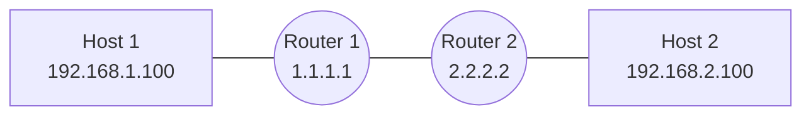

# Batfish Network Testing Demo

A complete example showing how to use [Batfish](https://www.batfish.org/) for network configuration validation — both interactively via Jupyter and automatically in a GitLab CI/CD pipeline.

## Project Structure

```
batfish-demo/
├── snapshot/                 # Snapshot directory
│   └── configs/              # Router/switch configuration files
│       ├── router1.cfg
│       └── router2.cfg
│   └── hosts/                # Host configuration files
│       ├── host1.json
│       └── host2.json
├── ci/
│   └── batfish_validate.py   # CI validation script (called by GitLab)
├── batfish_testing.ipynb     # Interactive Jupyter notebook
├── .gitlab-ci.yml            # GitLab pipeline definition
└── README.md
```

## Lab Topology

<br>


<br>
Both routers run OSPF and have ACLs blocking Telnet (TCP/23) inbound.

## Quick Start – Jupyter Notebook

### 1. Start Batfish

```bash
docker run -d -p 9997:9997 -p 9996:9996 batfish/batfish
```

### 2. Install Python dependencies

```bash
pip install pybatfish pandas jupyter
```

### 3. Launch the notebook

```bash
jupyter notebook batfish_testing.ipynb
```

Run all cells top-to-bottom. The notebook will:
- Parse your configs and report any syntax issues
- Display the routing tables
- Simulate traceroutes and assert reachability
- Verify that Telnet is blocked by ACLs
- Check for undefined/unused config structures
- Print a pass/fail test summary

---

## GitLab CI/CD Integration

### How it works

```
Push / MR → [batfish-validate]
```

| Stage | What happens |
|-------|-------------|
| `validate` | Batfish spins up as a Docker service; `ci/batfish_validate.py` runs all tests against the committed configs. Fails the pipeline if any test fails. |

### GitLab Variables to configure

| Variable | Description |
|----------|-------------|
| `BATFISH_HOST` | Override if using an external Batfish server instead of the service container |

### Pipeline artifacts

- `batfish_report.json` – Full JSON test report
- `batfish_junit.xml` – JUnit XML consumed by GitLab's test report UI (visible in MR sidebar)

---

## Tests Included

| Test | What it checks |
|------|---------------|
| Config parse status | All files parse without errors |
| Undefined references | No ACL/prefix-list/route-map used but never defined |
| HTTP reachability | 192.168.1.x can reach 192.168.2.x on TCP/80 |
| Telnet blocked | TCP/23 inbound is denied by BLOCK_TELNET ACL |
| Routing completeness | Both routers have routes to each other's subnets |
