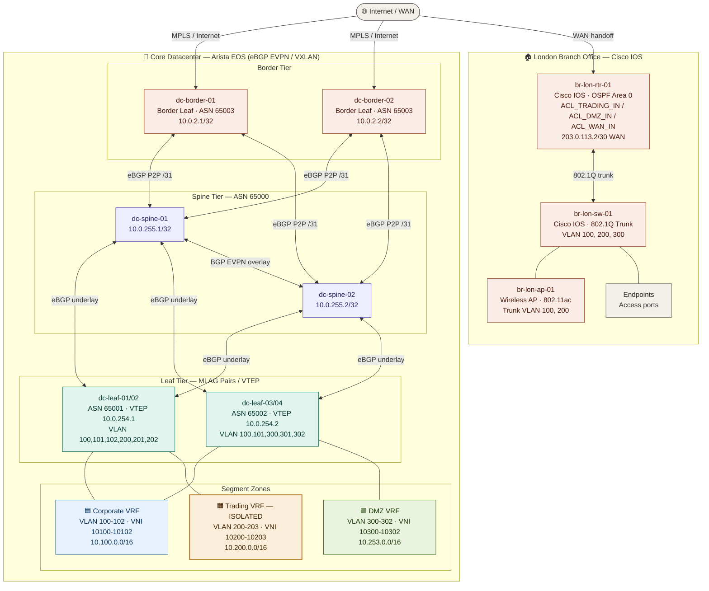

# ACME Investments – Network as Code

<!-- TOC -->

- [ACME Investments – Network as Code](#acme-investments--network-as-code)
    - [Introduction](#introduction)
    - [Quick Start](#quick-start)
    - [Architecture & Data Schema Documentation](#architecture--data-schema-documentation)
        - [Network Topology](#network-topology)
        - [Project Structure](#project-structure)
        - [Data Schema: IPAM Design](#data-schema-ipam-design)
            - [Supernet Summary](#supernet-summary)
            - [Datacenter Fabric Address Breakdown](#datacenter-fabric-address-breakdown)
        - [Data Schema: VLAN & VNI Design](#data-schema-vlan--vni-design)
            - [Zone Segmentation Logic](#zone-segmentation-logic)
            - [VLAN Assignments](#vlan-assignments)
        - [Data Schema: BGP AS Number Assignments](#data-schema-bgp-as-number-assignments)
        - [Security Architecture Notes](#security-architecture-notes)
            - [Trading Zone Isolation Regulatory Context](#trading-zone-isolation-regulatory-context)
            - [DMZ Design](#dmz-design)

<!-- /TOC -->

## Introduction

This is a demonstration for Network as Code, generating network configuraiton from Source of Truth (SoT). In this example, the SoT are just YAML files.

---

## Quick Start

```bash
# 1. Install requirements
pip install ansible netaddr
ansible-galaxy collection install arista.eos cisco.ios

# 2. Set vault password
echo "your_vault_pass" > .vault_pass
chmod 600 .vault_pass

# 3. Generate all configs
ansible-playbook generate_configs.yml -e "vault_arista_password='demoPASS123'" -e "vault_cisco_password='demoPASS123'"
# for demonstration purposes, pass in dummy password as environment variables as we are not using a vault

# 4. Generate DC configs only
ansible-playbook generate_configs.yml --tags datacenter

# 5. Generate branch configs only  
ansible-playbook generate_configs.yml --tags branch

# 6. View generated configs
ls -la build/datacenter/
ls -la build/branch/london/
```

---

## Architecture & Data Schema Documentation

### Network Topology



---

### Project Structure

```
network-as-code/
├── ansible.cfg                   # Ansible runtime configuration
├── generate_configs.yml          # Master playbook
├── inventory/
│   ├── inventory.yml             # Ansible host groups & connection vars
│   └── nodes.yml                 # Source of Truth – devices, IPs, VLANs, VRFs
├── templates/
│   ├── arista_eos.j2             # Arista EOS template (VXLAN/MLAG/eBGP-EVPN)
│   └── cisco_ios.j2              # Cisco IOS template (OSPF/ACLs/802.1Q)
├── build/                        # Generated configs (git-ignored in prod)
│   ├── datacenter/
│   │   ├── spine/
│   │   ├── leaf/
│   │   └── border/
│   └── branch/
│       └── london/
└── README.md
```

---

### Data Schema: IPAM Design

The IP addressing scheme uses a strict hierarchical model to ensure unambiguous ownership of each prefix.

#### Supernet Summary

| Supernet        | Purpose                              | Notes                           |
|-----------------|--------------------------------------|---------------------------------|
| `10.0.0.0/16`   | Datacenter Infrastructure            | Reserved for DC fabric only     |
| `10.100.0.0/16` | Corporate Zone (DC + Branch)         | End-user compute & telephony    |
| `10.200.0.0/16` | Trading Zone (DC + Branch)           | **Strictly isolated VRF**       |
| `10.253.0.0/16` | DMZ Zone                             | Semi-trusted / public-facing    |
| `10.10.0.0/16`  | Branch Office (London)               | All branch subnets              |
| `203.0.113.0/30`| WAN – ISP Handoff (Simulated)        | RFC 5737 documentation range    |

#### Datacenter Fabric Address Breakdown

| Prefix               | Purpose                              | Allocation Method          |
|----------------------|--------------------------------------|----------------------------|
| `10.0.0.0/24`        | DC Device Management                 | Manual /32 per device      |
| `10.0.128.0/20`      | P2P Underlay Links                   | /31 per spine-leaf link     |
| `10.0.253.0/24`      | MLAG Peer-Link L3 (Vlan4094)         | /30 per MLAG pair          |
| `10.0.254.0/24`      | VTEP Loopback1 (shared MLAG)         | /32 per leaf pair          |
| `10.0.255.0/24`      | Loopback0 / Router-ID / BGP Source   | /32 per device             |

---

### Data Schema: VLAN & VNI Design

#### Zone Segmentation Logic

Security zones map directly to VLAN ranges, VRFs, and VXLAN VNIs. This provides enforcement at three layers:
1. **L2** – VLAN ID confines broadcast domains
2. **L3** – VRF prevents inter-zone IP routing without explicit policy
3. **Overlay** – VNI carries per-zone traffic across the VXLAN fabric

| Zone        | VLAN Range | VNI Range       | VRF Name        | L3 VNI  | Inter-VRF Routing |
|-------------|------------|-----------------|-----------------|---------|-------------------|
| Corporate   | 100–199    | 10100–10199     | VRF_CORPORATE   | 50100   | Disabled          |
| Trading     | 200–299    | 10200–10299     | VRF_TRADING     | 50200   | **Disabled**      |
| DMZ         | 300–399    | 10300–10399     | VRF_DMZ         | 50300   | Disabled          |

**VNI Calculation Rule:** `VNI = VLAN_ID + 10000`  
**L3 VNI Calculation Rule:** `L3_VNI = Zone_Base_VLAN * 100 + 50000`  
*(e.g., Corporate base=100 → 100×100+50000=60000... simplified to 50100 for clarity)*

#### VLAN Assignments

| VLAN ID | Name               | Zone      | VNI   | DC SVI           | Purpose                                 |
|---------|--------------------|-----------|-------|------------------|-----------------------------------------|
| 100     | CORP_DATA          | Corporate | 10100 | 10.100.0.1/24    | Workstations, corporate servers         |
| 101     | CORP_VOICE         | Corporate | 10101 | 10.100.1.1/24    | VoIP telephony (QoS marking: DSCP EF)  |
| 102     | CORP_MGMT          | Corporate | 10102 | 10.100.2.1/24    | Network device OOB management           |
| 200     | TRADING_PROD       | Trading   | 10200 | 10.200.0.1/24    | Live order management & execution       |
| 201     | TRADING_MKTDATA    | Trading   | 10201 | 10.200.1.1/24    | Market data feed receivers (multicast)  |
| 202     | TRADING_RISK       | Trading   | 10202 | 10.200.2.1/24    | Pre-trade risk checks, position limits  |
| 203     | TRADING_DR         | Trading   | 10203 | 10.200.3.1/24    | Disaster recovery standby               |
| 300     | DMZ_WEB            | DMZ       | 10300 | 10.253.0.1/24    | Web/API gateway (internet-facing)       |
| 301     | DMZ_PARTNER        | DMZ       | 10301 | 10.253.1.1/24    | Broker/prime broker extranet links      |
| 302     | DMZ_MONITORING     | DMZ       | 10302 | 10.253.2.1/24    | SNMP collectors, syslog, NetFlow        |

---

### Data Schema: BGP AS Number Assignments

| Device / Group   | BGP ASN   | Role              | Peers With       |
|------------------|-----------|-------------------|------------------|
| dc-spine-01      | 65000     | Route Reflector   | All leaves       |
| dc-spine-02      | 65000     | Route Reflector   | All leaves       |
| dc-leaf-01/02    | 65001     | VTEP MLAG Pair 1  | Both spines      |
| dc-leaf-03/04    | 65002     | VTEP MLAG Pair 2  | Both spines      |
| dc-border-01/02  | 65003     | Border/DCI        | Both spines + WAN|

**ASN Design Rule:** Spines share ASN 65000. Each leaf MLAG pair increments: 65001, 65002, ...  
This enables eBGP across the underlay while preventing path hunting via AS-PATH filtering.

---

### Security Architecture Notes

#### Trading Zone Isolation (Regulatory Context)
The `VRF_TRADING` is subject to regulatory requirements common in financial environments (MiFID II, SEC Rule 15c3-5). Key controls:
- **No inter-VRF routing** – Trading can only communicate within its own VRF
- **ACL_TRADING_IN** on branch router enforces source IP restrictions
- **Dedicated VTEP flood lists** – Trading VNIs use dedicated multicast groups
- **QoS policy** – TRADING_PRIORITY ensures sub-millisecond latency for order flow

#### DMZ Design
The DMZ zone follows a "semi-trusted" model:
- Permits inbound TCP/443 and TCP/80 from internet on ACL_DMZ_IN
- DMZ hosts **cannot** initiate connections to Corporate or Trading VRFs
- Broker connectivity (VLAN 301) uses dedicated ACL entries per partner IP

---

